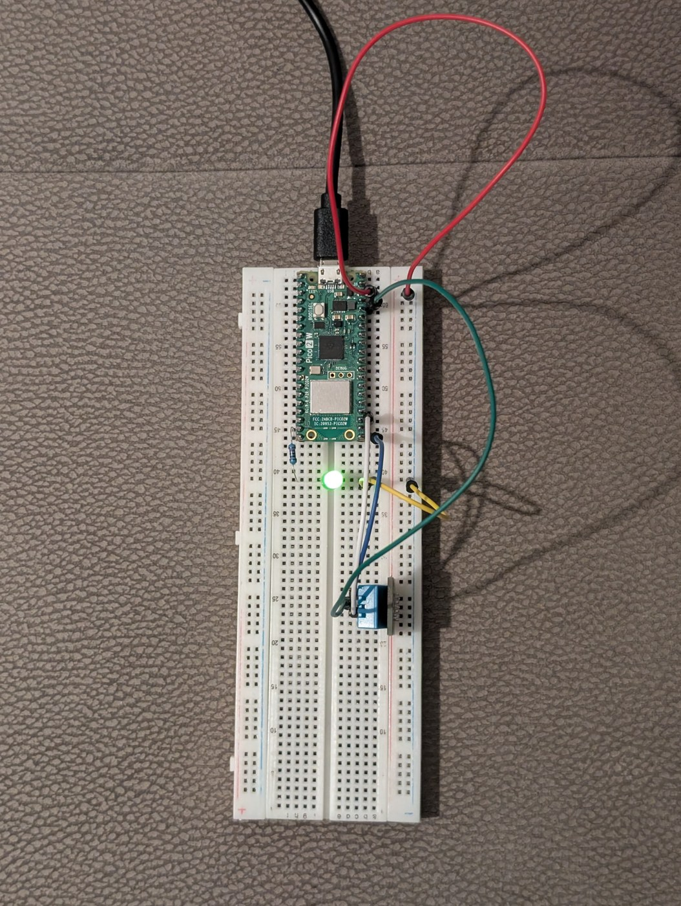
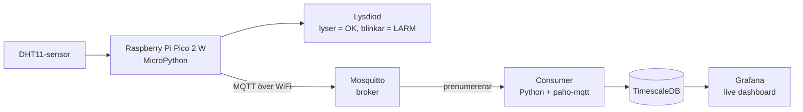
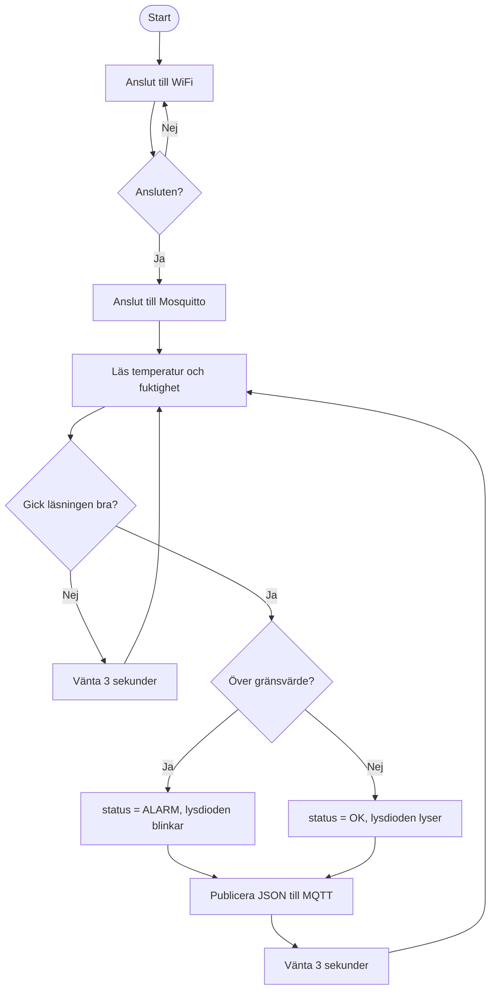
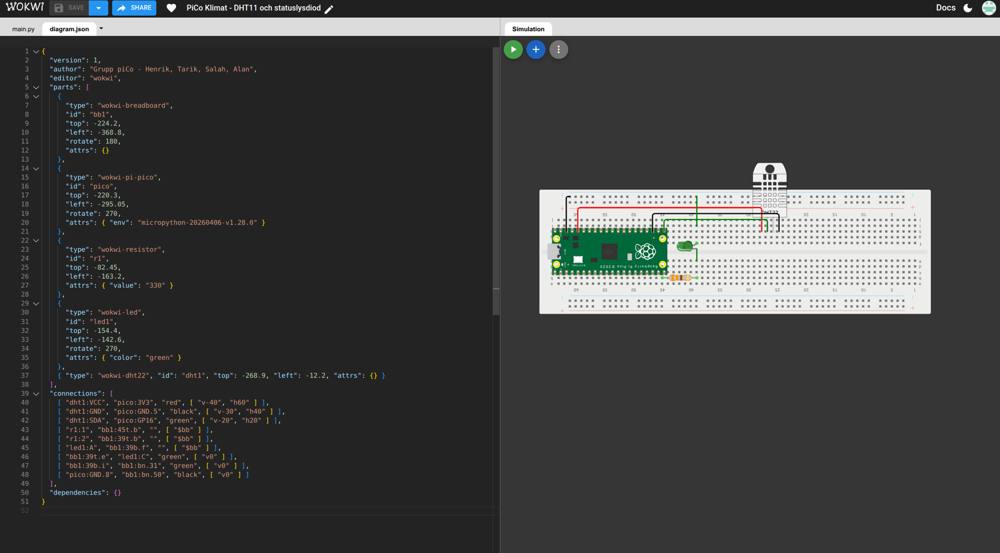
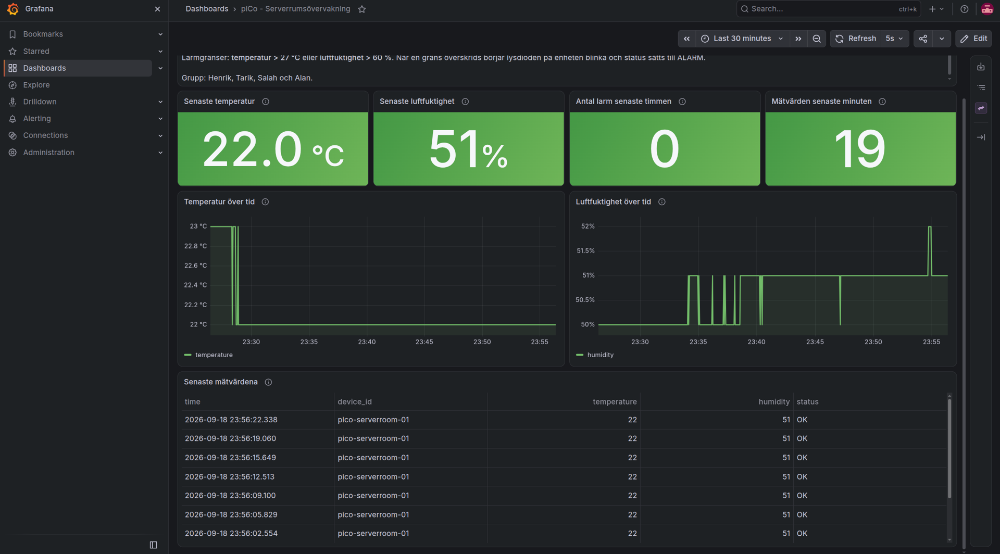

# piCo Serverrumsvakt

Ett projekt i kursen Edge computing. Vi har byggt ett proof of concept åt πCo: en liten
edge-enhet som övervakar klimatet i ett serverrum och larmar när det blir för varmt eller
för fuktigt.

Gruppmedlemmar: Henrik ([@hencyber](https://github.com/hencyber)), Tarik
([@mulisictarik](https://github.com/mulisictarik)), Salah
([@Salah-Ud-Din01](https://github.com/Salah-Ud-Din01)) och Alan
([@alanzangana1](https://github.com/alanzangana1)).

## Problemet vi löser

I ett serverrum eller ett elskåp får det inte bli för varmt, för då börjar servrarna strypa
prestandan och i värsta fall stängs de av. Blir luftfuktigheten för hög riskerar man istället
kondens och korrosion på elektroniken. Många mindre företag har ingen övervakning alls i sina
serverrum utan märker problemet först när något har gått sönder.

Vår produkt är en billig sensor-enhet (under 300 kr per styck) som mäter temperatur och
luftfuktighet var tredje sekund, visar status direkt på plats med en lysdiod,
och skickar all data vidare till en dashboard där man kan se historiken och upptäcka trender
innan det blir ett problem.

## Hårdvara

| Komponent | Ansluten till |
| --------- | ------------- |
| DHT11 (KY-015) data | GP16 |
| DHT11 VCC | 3V3 |
| DHT11 GND | GND |
| Grön lysdiod (status) | GP15 via 330Ω motstånd |

Hela materiallistan med priser och motiveringar finns i [BOM_pico_serverrum.xlsx](BOM_pico_serverrum.xlsx).
I den filen kan man ändra antalet prototyper i cell B2 så räknas antal komponenter och
kostnader om automatiskt.



På bilden lyser statuslysdioden grönt, alltså är klimatet inom gränsvärdena.

## Arkitektur



Allt utom Pico:n körs i Docker-containrar på en laptop.

## Flödesschema för koden på Pico:n



Meddelandet som skickas ser ut så här:

```json
{"device_id": "pico-serverroom-01", "temperature": 24, "humidity": 41, "status": "OK"}
```

## Mappstruktur

```
pico-serverrum/
├── src_pico/            # koden som ligger på Pico:n
│   ├── main.py
│   ├── wifi.py
│   └── umqtt/
├── src_pipeline/        # allt som körs i docker
│   ├── consumer.py
│   ├── docker-compose.yaml
│   ├── grafana/
│   └── utils/
├── wokwi/               # simuleringen
├── docs/                # arbetssätt och rapportmall
└── BOM_pico_serverrum.xlsx
```

## Simulering i Wokwi

Innan vi kopplade upp något på riktigt byggde vi kretsen i
[Wokwi](https://wokwi.com/). Filerna finns i [wokwi/](wokwi/). Skapa ett nytt
MicroPython-projekt för Pico, klistra in `diagram.json` och `main.py` så går det att köra.

I Wokwi finns ingen DHT11 och ingen Mosquitto-broker, så simuleringen använder en DHT22 och
skriver ut mätvärdena i REPL istället för att publicera dem. Logiken för gränsvärden och
lysdioden är exakt densamma som på riktig hårdvara.



Simuleringen kör samma logik som den riktiga enheten och skriver ut mätvärdena i konsolen.

## Så kör man projektet

### 1. Pico:n

1. Installera MicroPython på Pico 2 W enligt kursens setup-guide.
2. Kopiera `src_pico/wifi_credentials.example.json` till `wifi_credentials.json` och fyll i
   ert WiFi. Filen är med i `.gitignore` så lösenordet hamnar aldrig på GitHub.

   > **Pico 2 W klarar bara 2,4 GHz.** Datorn kan mycket väl sitta på 5 GHz utan att ni
   > tänker på det, och då ser Pico:n inte samma nät fastän det heter likadant. Skriv också
   > av nätverksnamnet exakt. Vår telefons hotspot heter `Slutalåna mobil ` med ett
   > mellanslag på slutet, och utan det mellanslaget hittas nätet inte alls.
3. Ändra `MQTT_BROKER` i `src_pico/main.py` till IP-adressen för datorn som kör Docker.
4. Ladda upp hela `src_pico/`-mappen till Pico:n med MicroPico i VS Code.

### 2. Pipelinen

```bash
cd src_pipeline
cp .env.example .env     # fyll i egna lösenord
docker compose up -d --build
```

Då startar fyra containrar: `mosquitto`, `consumer`, `timescaledb` och `grafana`.

### 3. Grafana

Gå till <http://localhost:3000> och logga in med användarnamnet och lösenordet från `.env`.
Datakällan och dashboarden läggs in automatiskt, så dashboarden **piCo -
Serverrumsövervakning** ska redan finnas där. Den uppdaterar sig själv var femte sekund.



Dashboarden innehåller:

- senaste temperatur och senaste luftfuktighet som KPI:er med färg när gränsvärdet passeras
- antal larm senaste timmen
- antal mätvärden senaste minuten, som blir röd om enheten slutat höra av sig
- grafer över temperatur och luftfuktighet som uppdateras live
- en tabell med de tio senaste mätvärdena

### Varför vi har en panel som räknar mätvärden

De andra panelerna visar det senaste värdet i databasen. Problemet är att ett gammalt värde
ser precis lika friskt ut som ett färskt. När vi av misstag stoppade programmet på Pico:n
stod det fortfarande 23 °C och 49 % på dashboarden, fast siffrorna var fem minuter gamla och
enheten var tyst.

Därför räknar vi hur många mätvärden som kommit in den senaste minuten. Med tre sekunder
mellan mätningarna ska det vara ungefär tjugo. Blir det noll blir panelen röd, och då vet man
att det är enheten som tystnat och inte serverrummet som blivit stilla. En dashboard ska
kunna skilja på "allt är lugnt" och "jag hör ingenting".

## Problem vi stötte på

- DHT11:an svarar inte varje gång man frågar den. Vi fick lägga läsningen i en `try/except`
  och hoppa över den mätningen istället för att hela programmet kraschade.
- Mosquitto i Docker släpper som standard bara in anslutningar från samma maskin. Vi la till
  en egen `mosquitto.conf` med `listener 1883` och `allow_anonymous true` för att Pico:n
  skulle komma in.
- Consumern startade snabbare än databasen första gången och kraschade. Vi löste det med en
  `time.sleep(5)` i början och `restart: on-failure` i docker compose.
- DHT11:an ger bara heltal, så temperaturen hoppar med ett helt grader i taget i grafen.
- Den värsta buggen: när Pico:n startar från strömpåslag hinner wifi-radion inte ansluta
  inom de 20 sekunder kurskodens `connect_wifi` väntar. Vår första version kastade då ett
  exception och gav upp för gott, så enheten var död tills man körde igång den för hand. Att
  bara försöka om gjorde det värre, för varje nytt `connect_wifi` avbryter den anslutning som
  redan pågår. Lösningen blev att ge radion 90 sekunder innan vi börjar om.
- Vi körde först mot hemmanätet, och där tappade Pico:n kontakten hela tiden fast datorn
  stod stabilt. Det visade sig vara att Pico 2 W bara klarar 2,4 GHz medan datorn satt på
  5 GHz. Routern hade samma namn på båda banden, så det syntes inte. Vi flyttade båda till
  en telefon-hotspot istället och då blev det stabilt.
- Vi hade planerat en grön och en röd lysdiod, men hade bara en grön hemma. Istället för
  att vänta på en röd löste vi det i koden: lysdioden lyser fast när allt är OK och blinkar
  när det är larm. Det syns faktiskt tydligare på håll än två färger.

## Arbetssätt

Vi har jobbat med GitHub Projects, issues och branches. Vårt gemensamma arbetssätt finns
beskrivet i [docs/arbetssatt.md](docs/arbetssatt.md).
